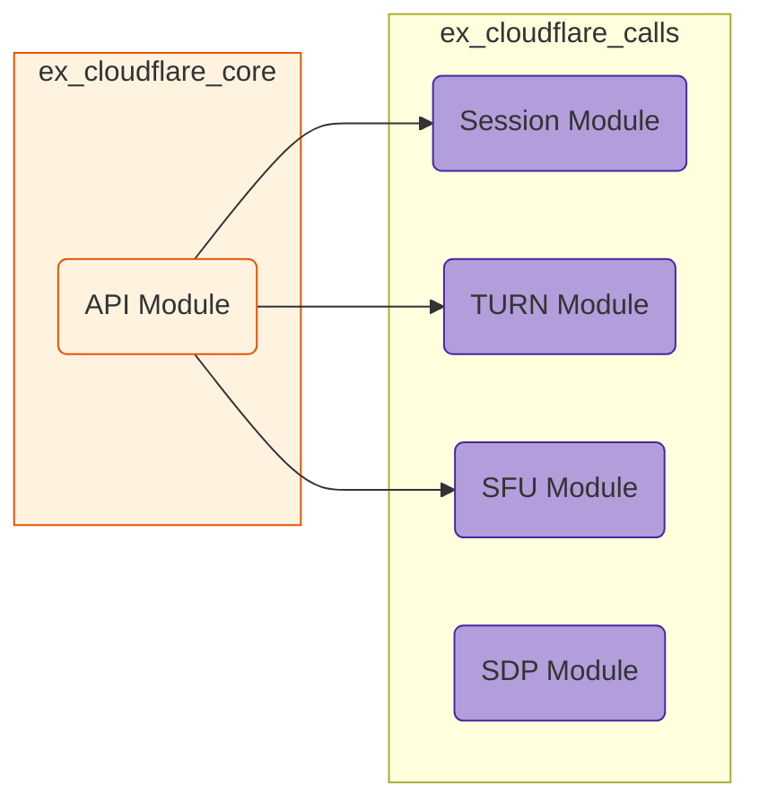

# ExCloudflareCalls

**TODO: Add description**

## Installation

If [available in Hex](https://hex.pm/docs/publish), the package can be installed
by adding `ex_cloudflare_calls` to your list of dependencies in `mix.exs`:

```elixir
def deps do
  [
    {:ex_cloudflare_calls, "~> 0.1.0"}
  ]
end
```

Documentation can be generated with [ExDoc](https://github.com/elixir-lang/ex_doc)
and published on [HexDocs](https://hexdocs.pm). Once published, the docs can
be found at <https://hexdocs.pm/ex_cloudflare_calls>.


## Usage

# Configuration
config = ExCloudflareCalls.Config.new(
  System.get_env("CALLS_API"),
  System.get_env("CALLS_APP_ID"),
  System.get_env("CALLS_APP_SECRET")
)

# Create a room with all features
{:ok, room} = ExCloudflareCalls.Room.create_room(config)

# Join with WebRTC
{:ok, connection} = ExCloudflareCalls.Room.join_room(room, sdp)

# Start broadcasting
{:ok, broadcast} = ExCloudflareCalls.Room.start_broadcast(room, sdp)

# Send data channel message
:ok = ExCloudflareCalls.Room.send_message(room, "Hello!")


**1.  `ex_cloudflare_calls` Architecture:**



**Discussion:**

`ex_cloudflare_calls` is a low-level library specifically for Cloudflare Calls. It's structured around three core components: Session Management, TURN Server management, and SFU parameter controls.

The **`Session Module`** is responsible for implementing all functions related to the lifecycle of calls sessions such as creating, renegotiation, closing.
  It will use `ex_cloudflare_core` to make those HTTP API requests using the API module while keeping track of all calls specific information, and transforming the response data to match the Elixir domain requirements. This pattern will be followed in all modules.
  
 The **`TURN Module`**  exposes the functionalities to create, read, update, and delete TURN keys. All of these requests will rely on the underlaying `ExCloudflareCore.API`.

The  **`SFU Module`**   will provide utilities for manipulating Cloudflare SFU specific configuration. This will also depend on the underlaying `ExCloudflareCore.API` module to execute requests.

 The **`SDP Module`** is a stateless utility that contains all functions related to SDP manipulation (currently just Opus DTX).

The primary design consideration here is to separate the low-level details about making http requests to a module (`ex_cloudflare_core`) to avoid having to reimplement the same logic in each of the modules here, while still being able to make granular changes at the Cloudflare calls level. Note that this module is stateless and does not have a supervision tree associated with it because it doesn't handle a lifecycle of a long running process.
